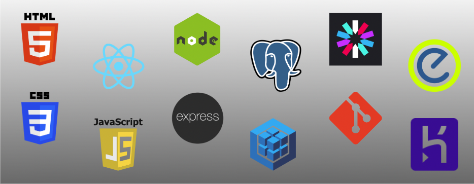
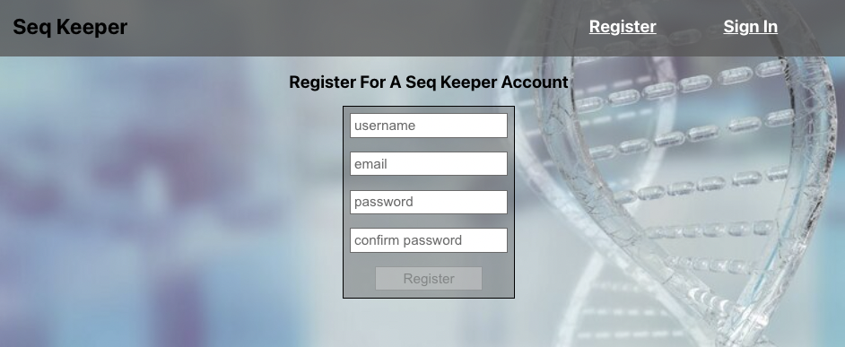
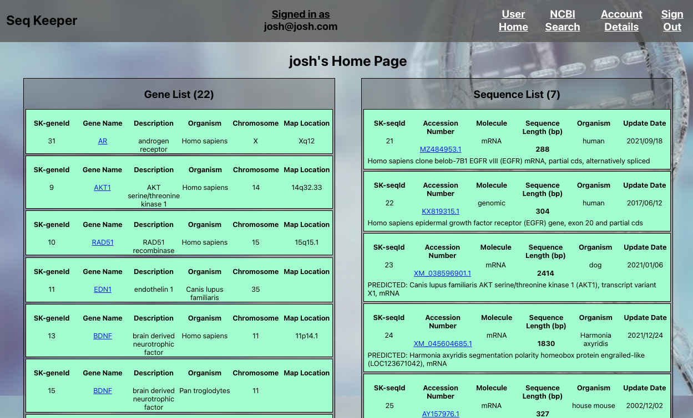
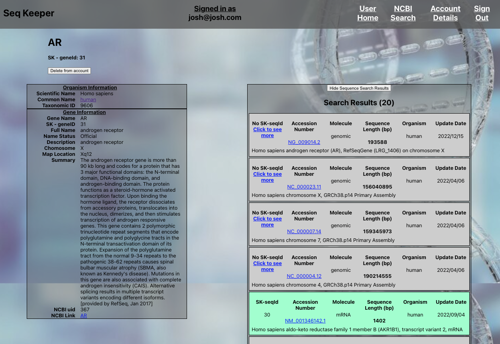
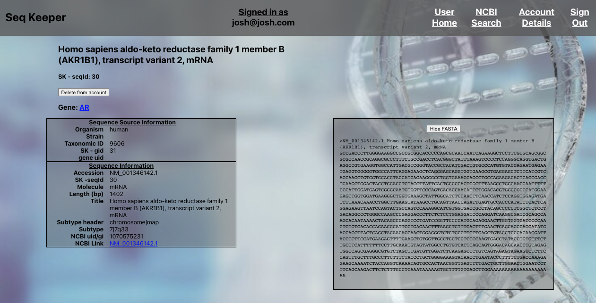

### Date: December 15, 2022

---

### **_Creator_**: Josh Levine

[Website]() | [GitHub](https://github.com/jadlevine) | [LinkedIn](https://www.linkedin.com/in/joshua-adam-levine/)

---

### **_Description_**

A full stack application for researching and curating genes and their known sequences.

---

### **_Technologies Used_**

---

### **_Planning_**

You can see the planning of this project on Trello, [here](https://trello.com/b/BPpOhQ9x/seq-keeper)

An Entity Relationship Diagram (ERD) of the data models can be found [here](https://drive.google.com/file/d/1pu_gBItMIm7eFgA6dT51EIxQ-Jg-Sp0f/view?usp=sharing)

A Component Hierarchy Diagram (CHD) of the structure of the React app can be found [here](https://drive.google.com/file/d/1hBGsjTrU7Cw9RS-O6ioQqnudeqJ0uNjK/view?usp=sharing)

---

### **_Getting Started_**

To use this application, navigate to the deployed version on Heroku, [here - heroku link](herokulink)

**Using the application**

1. Register for an account, using a valid email address.
2. Sign in to your account.
3. Click on any of the links in the Navigation Bar at any time to navigate.
4. User Home Page - displays your genes and sequences

   - Initially, your Gene and Sequence Lists will be empty. Use "NCBI Search" in the navigation bar to find genes.
   - Once you have added genes and sequences to your account, they will appear with a light-blue background in the application.

5. Gene Details Page - displays gene details

   - _Add to Account_ or _Delete from account_ will be conditionally rendered depending on whether the gene is associated with your account.
   - Once added, options to _Find \<gene\> Sequences_ and _Find Homologous Genes_ will appear. Click on either button to see records.
   - Click on Genes or Sequences to go to the details page for that record.

6. Sequence Details Page - displays sequence details

   - Click on _View FASTA Sequence (\<length\>)_ to see the sequence.
     - ### **NOTE - Very large sequences (>100,000 bp) can slow the application considerably.**
   - Viewing the FASTA sequence enables the _Add this Sequence_ button, which will add the sequence to your account.

---

### **_Screenshots_**

#### Register Page

#### User Home Page

#### Gene Details Page

#### Sequence Details Page

### **_Future Updates_**

- [x] ~~Conditional rendering of gene and sequence options~~
- [x] ~~Add Homologous Gene Search~~
- [ ] Add Chromosome map visualizations
- [ ] Add BLAST sequence search
- [ ] Add Protein Sequence search
- [ ] Add Protein Structure visualization
- [ ] Allow user to specify homologous relationships between genes
- [ ] Implement MUSCLE to perform multiple sequence alignments
- [ ] Implement Phylotree.js to create and visualize Phylogenetic Trees
- [ ] Allow user to perform custom searching and filtering
- [ ] Implement modal and/or MUI for front-end UI.

---

### **_Credits_**

[NCBI/Entez](https://www.ncbi.nlm.nih.gov/search/)

[validator](https://www.npmjs.com/package/validator)

[react-xml-parser](https://www.npmjs.com/package/react-xml-parser)
